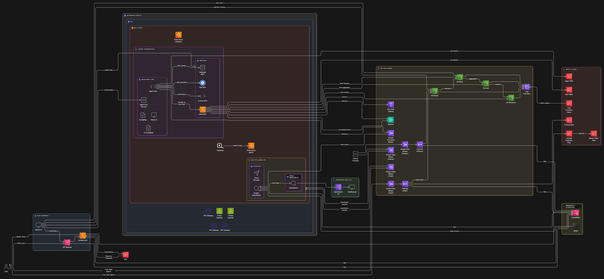

# Project Nexus

Project Nexus delivers an AI-driven, cloud-native platform for ingesting, translating, enriching, and disseminating multimodal data at scale. The stack combines AWS-managed services for resilient infrastructure with a pluggable suite of Model Context Protocol (MCP) services and a Python agent core that orchestrates workflows using Amazon Bedrock foundation models.



---

## Table of Contents
- [Key Capabilities](#key-capabilities)
- [Solution Overview](#solution-overview)
- [Repository Layout](#repository-layout)
- [Core Components](#core-components)
- [Environments and Configuration](#environments-and-configuration)
- [Security and Compliance](#security-and-compliance)
- [Operational Guidelines](#operational-guidelines)
- [Roadmap Ideas](#roadmap-ideas)
- [Reference Documents](#reference-documents)

---

## Key Capabilities
- **Token-mediated streaming ingress** – API Gateway + Lambda mint short-lived bearer tokens (backed by STS credentials) that grant producers/consumers controlled access to dedicated Kinesis Data and Video Streams. Firehose automatically lands authenticated data in the bronze medallion tier.
- **Agentic control plane** built around the Nexus Agent Core which invokes Bedrock models and coordinates MCP services for AWS, custom analytics, database access, and Kubernetes automation.
- **Multi-service MCP fabric** deployed on Amazon EKS, enabling modular tools for data transformation, dissemination, and cluster operations.
- **Authentication edge** via Amazon API Gateway backed by a Python Lambda (pluggable with future Cognito/OIDC providers) and a configurable front-end UI.
- **Infrastructure as Code** defined in Terraform to provision networking, IAM, observability, and compute resources in AWS us-west-2.

---

## Solution Overview
Project Nexus spans three logical planes:

1. **Foundation Plane (AWS Infrastructure)** – Terraform provisions a VPC, subnets, NAT, EKS clusters, IAM roles (IRSA for agent and AWS MCP services), Kinesis services, Lake Formation registration, and the API/Lambda edge.
2. **Control Plane (EKS namespaces)** – The `nexus-agent-core` namespace runs the Python agent, UI, and supporting components, while `nexus-mcp` hosts MCP services with dedicated service accounts and IRSA bindings. `nexus-data` is reserved for future data-plane workloads.
3. **Experience Plane (UI & APIs)** – An API Gateway exposes authenticated endpoints for UI workflows. The UI (deployed on EKS) allows operators to configure data sources/destinations and visualize telemetry on a map.

High-level flow:
1. Producers authenticate through the `/auth` route, receive a bearer token containing STS credentials, and use those credentials to write to dedicated client Kinesis Data/Video Streams.
2. Kinesis Firehose (primary and client channels) delivers raw records into the bronze S3 bucket; Lake Formation governs downstream access to refined tiers.
3. The Agent Core consumes stream events, invokes MCP services (AWS, custom analytics, database queries, Kubernetes actions), and uses Bedrock models for reasoning or summarization.
4. Outputs land in silver/gold/vibranium buckets and can be disseminated to downstream systems via MCP dissemination services and the UI.

Detailed component and data-flow descriptions are documented in `Architecture.md`.

---

## Repository Layout
```
terraform/           # AWS infrastructure-as-code
kubernetes/          # Kustomize manifests for EKS deployments
services/            # Python sources for agent core + MCP services
lambda/              # Lambda auth function packaged by Terraform
├─ auth/
└─ dist/             # Terraform-generated ZIP (ignored)
```
Supporting documentation:
- `Architecture.md` – subsystem descriptions and data flows
- `Deployment_guide.md` – step-by-step deployment instructions

---

## Core Components

### Terraform Stack (`terraform/`)
- **Network** – VPC with three AZs, public/private subnets, NAT gateway, DNS support.
- **EKS Cluster** – Two managed node groups (general workloads and MCP-tolerated nodes) and optional Karpenter integration.
- **IAM** – IRSA roles for the agent core and AWS MCP service (Bedrock, Glue, S3, Kinesis permissions), Lambda execution roles, Firehose role/policies, and a bearer-token role assumed by Lambda to mint limited Kinesis credentials.
- **Medallion Data Lake** – Versioned, AES256-encrypted S3 buckets (bronze → vibranium) registered with Lake Formation.
- **Streaming Services** –
  - Primary channel: Kinesis Data Stream (`*-intake`), Video Stream (`*-telemetry`), Firehose (`*-to-lake`).
  - Client channel: Kinesis Data Stream (`*-client-intake`), Video Stream (`*-client-telemetry`), Firehose (`*-client-to-lake`) landing in the bronze bucket under the `client/` prefix.
- **Edge/API** – HTTP API Gateway + Lambda auth function with CloudWatch logging and optional custom domain mapping.

### Kubernetes Manifests (`kubernetes/`)
- **Namespaces** – `nexus-agent-core`, `nexus-mcp`, `nexus-data`.
- **Agent Core** – Deployment, ConfigMap, Service; mounts YAML config describing Bedrock models, MCP endpoints, and both primary/client pipeline resources.
- **MCP Services** – Four deployments (AWS, custom, database, Kubernetes) each with service accounts, probes, and services for internal discovery.
- **UI** – Deployment + ConfigMap for API URL and map styling, Service for internal access (fronted via API Gateway/LB integration in future).

### Python Services (`services/`)
- **Agent Core** – Configurable orchestrator invoking Bedrock and MCP tools; provides HTTP API for workflow execution and health endpoints.
- **AWS MCP** – Wraps S3, Bedrock, and Glue operations with IRSA credentials.
- **Custom MCP** – Provides key-value storage and external weather enrichment (demonstration of arbitrary tools).
- **Database MCP** – Exposes SQLite-backed SQL execution.
- **Kubernetes MCP** – Uses in-cluster RBAC to list pods, scale deployments, and troubleshoot workloads.

### Lambda Auth (`lambda/auth`)
- Issues bearer tokens containing temporary AWS credentials (STS) scoped to the client Kinesis Data/Video streams and Firehose delivery stream.
- Replace with Cognito/OIDC for production-grade auth and secret management.

---

## Environments and Configuration

| Concern | Location | Notes |
|---------|----------|-------|
| AWS Region | Terraform variable `region` | Defaults to `us-west-2`; update prior to deployment. |
| Environment Tag | Terraform variable `environment` | Propagated to resource naming and tagging. |
| Bedrock Models | `terraform/variables.tf` (`agent_bedrock_models`) & `kubernetes/agent-core/configmap.yaml` | Align list of approved models with Bedrock account access. |
| IAM Role ARNs | Terraform outputs (`aws_iam_role.agent_irsa`, `aws_iam_role.aws_mcp_irsa`) | Patch into service-account annotations before applying manifests. |
| Client Bearer Role | Terraform output/state (`aws_iam_role.kinesis_bearer`) | Lambda assumes this role to mint tokens; adjust policy scope as required. |
| Stream Names | Lambda env + `kubernetes/agent-core/configmap.yaml` | Update if you customize stream naming conventions. |
| UI/API endpoint | `kubernetes/ui/configmap.yaml` | Set to Terraform `ui_api_gateway_url` output. |
| Map Telemetry | `kubernetes/mcp-services/configmap.yaml` & UI ConfigMap | Configure map style identifiers or tokens. |

Operational configuration is primarily driven through ConfigMaps and Terraform variables so infrastructure and workloads stay declarative.

---

## Security and Compliance
- **Identity** – IRSA enforces least-privilege IAM for pods; Lambda assumes a dedicated `*-kinesis-bearer` role to issue short-lived credentials to external producers.
- **Data at Rest** – All S3 buckets enforce SSE-S3 (AES256) encryption. Extend to SSE-KMS if customer-managed keys are required.
- **Data in Transit** – API Gateway provides TLS termination. Within the cluster, consider adding mTLS/Service Mesh for east-west encryption.
- **Secrets Management** – Replace placeholder secrets (e.g., map tokens) with AWS Secrets Manager or Kubernetes Secrets integrated via External Secrets.
- **AuthN/AuthZ** – The sample Lambda issues STS-backed bearer tokens; integrate with Cognito, IAM Identity Center, or third-party IdPs to manage identity, token signing, and revocation.
- **Compliance** – Tagging aligns with `Project` and `Environment`; extend for cost allocation or compliance frameworks (e.g., PCI, FedRAMP) as needed.

---

## Operational Guidelines
- **Monitoring** – Enable CloudWatch Container Insights, deploy Prometheus/Grafana, or integrate AWS Managed Prometheus for MCP metrics. Track Firehose and Kinesis metrics for both primary and client channels.
- **Logging** – Ensure Firehose, Lambda, and application logs ship to CloudWatch; consider OpenSearch or S3-based analytics for long-term retention.
- **Backup/DR** – Bronze/Silver/Gold buckets are versioned; evaluate cross-region replication if RPO/RTO requirements demand it.
- **Cost Management** – Monitor shard counts for both Kinesis streams, Firehose buffering intervals, EKS node group sizing, and Bedrock inference usage.
- **CI/CD** – Automate Terraform plans, image builds (e.g., CodeBuild/GitHub Actions), and `kubectl apply -k` or GitOps pipelines (Argo CD/Flux).
- **Testing** – Incorporate integration tests that exercise MCP APIs, token issuance, and streaming ingestion (e.g., k6, Locust, or custom scripts).

---

## Roadmap Ideas
1. Replace sample auth Lambda with Cognito-hosted login and JWT validation.
2. Add automated data quality pipelines (Glue/Athena) feeding Silver/Gold enrichment steps.
3. Introduce event-driven orchestration (Step Functions or EventBridge) for complex workflows.
4. Provide Helm charts or an ArgoCD application set for multi-environment promotion.
5. Expand UI with configurable source/destination registries and real-time telemetry dashboards.

---

## Reference Documents
- [`Architecture.md`](Architecture.md) – Narrative describing components and data flows.
- [`Deployment_guide.md`](Deployment_guide.md) – Detailed deployment checklist.
- `services/README.md` – Service-level implementation notes.

For questions or contributions, open an issue or submit a pull request once the project is hosted in your chosen VCS platform.
